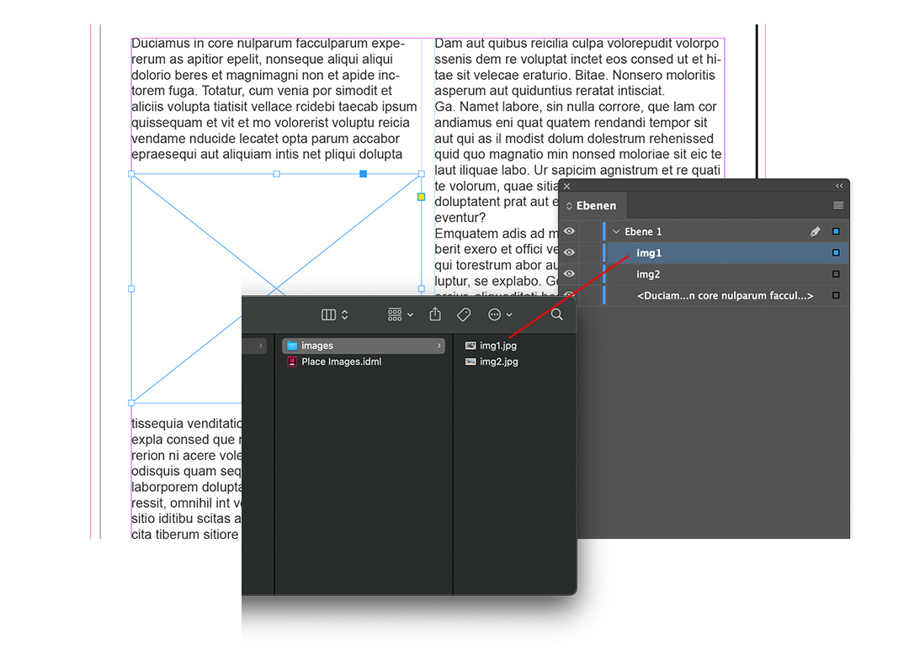

# Bilder platzieren

Dieses Script platziert automatisch Bilder aus einem Verzeichnis.
Der Objektname muss dabei den Namen des Bildes besitzen.

**Hinweis WIP**

Es erfolgen keine Fehlerprüfungen und auch die Dateiendung des Bilder wird ignoriert.
